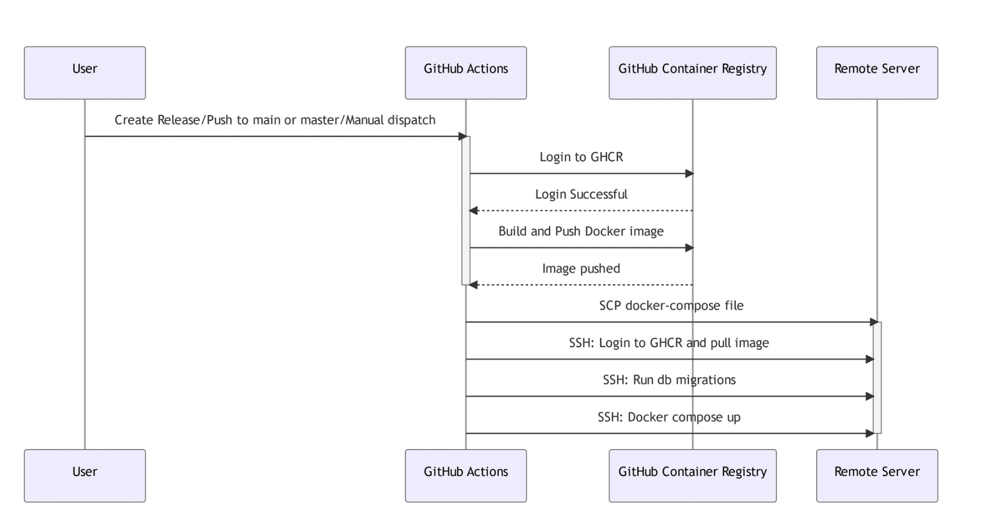

# Golang gin example

# 環境

go version go1.21.4

# Install

```
  $ go install
```

# Development

```
  $ GIN_MODE=debug go run main.go
```

# Generator Swagger

1. install swagger first

```go
go install github.com/swaggo/swag/cmd/swag@latest
# make sure change PATH to include in "/user/{yourname}/go/bin" in  .zshrc or .bash_profile

# source .zshrc or .bash_profile
source ~/.zshrc
```

```
  $ swag init -g main.go -o docs --parseDependency --parseInternal
```

# 部署參考

編譯程式碼結果主要分成兩大類,編譯後產生執行檔打包上傳,以及編譯後把執行打成 image.
部署過程會依據打包方式, 如果是打包執行檔就要把執行檔放到對應機器跑起來(如果是 vm 就用 ssh,如果是雲端容器可以透過專屬套件),同理也可以放到 image , 跑起來的方式一班可以用指令帶參數執行或者帶腳本執行,如果是 image 可以把 docker-compose.yml 放到指定機器然後執行.

本次 CICD 統一採用打包成 image 然後 ssh 到機器的部署模式,會透過把 docker-compose.yml scp 複製過去的方式跑起來.


1. https://docs.servicestack.net/ssh-docker-compose-deploment#docker-compose.yml
2. https://jiangshuuu.com/docs/CICD/github-action-deploy-cd/
3. https://docs.github.com/zh/actions/learn-github-actions/understanding-github-actions 這邊討論基本組成 of github action
4. https://github.com/actions/starter-workflows/blob/main/deployments/azure-webapps-java-jar-gradle.yml 官網示範部署

# 參考資料

[go-gin-example](https://github.com/eddycjy/go-gin-example)

[go-json-web-tokens](https://medium.com/%E4%BC%81%E9%B5%9D%E4%B9%9F%E6%87%82%E7%A8%8B%E5%BC%8F%E8%A8%AD%E8%A8%88/golang-json-web-tokens-jwt-olang-json-web-tokens-jwt-%E7%A4%BA%E7%AF%84-225b377e0f79)

[gorm-PostgreSQL](https://www.sqliz.com/posts/golang-gorm-postgresql/)

[mac-docker-app](https://docs.docker.com/desktop/install/mac-install/)

[gorm](https://gorm.io/docs/)

[gorm-Migration](https://gorm.io/docs/migration.html)

[gorm-Model](https://gorm.io/docs/models.html)

[Atlas Integration](https://atlasgo.io/)

[Atlas Versioned Migrations](https://atlasgo.io/concepts/declarative-vs-versioned#versioned-migrations)
